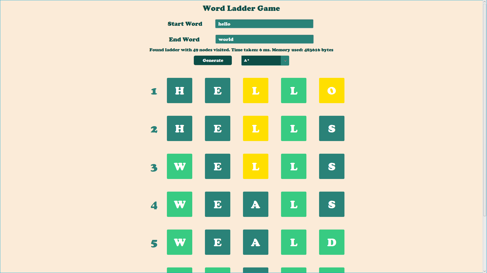
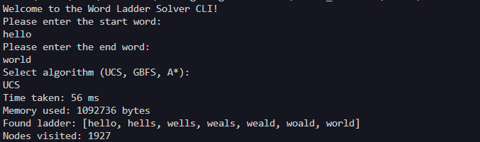

<h1 align="center">Tugas Kecil 3 IF2211 Strategi Algoritma</h1>
<h2 align="center">Semester II Tahun 2023/2024</h2>
<h3 align="center">Penyelesaian Permainan Word Ladder Menggunakan Algoritma UCS, Greedy Best First Search, dan A*</h3> 

## Table of Contents

- [Overview](#overview)
- [Abstraction](#abstraction)
- [Built With](#built-with)
- [Prerequisites](#prerequisites)
- [Installation](#installation)
- [File Structures Overview](#file-structures-overview)
- [Documentation](#documentation)
- [Links](#links)


## Overview
Owner :
- 13522019 - Wilson Yusda

<p>Our Lecturer : Dr. Ir. Rinaldi Munir, M.T.</p>

Here is the purpose of making this project :
- To fulfill the requirements of the third small assignment for the course IF2211 Algorithm Strategy.
- To implement UCS, GBFS and A* algorithm in solving word ladder problem

## Abstraction

This project compares UCS, GBFS, and A* computational, memory, and time efficiency in solving a word ladder problem and fing the most optimal result.

## Built With

- [Java](https://docs.oracle.com/en/java/)
- [Java FX](https://docs.oracle.com/javase/8/javafx/api/toc.htm)
- [Maven](https://maven.apache.org/guides/index.html)

## Prerequisites

To run this project, you will need to perform several installations, including:
- Java 8 or newer must be installed on your machine to compile and run the code.
- For Linux, The latest version of Java must be installed on your machine to compile and run the code which already have a class file version 64.0. Some might require JDK 17 which can be downloaded from wsl terminal. 
- The latest version of Apache Maven must be installed and also to set the PATH on environment variables to the bin of your Apache files.


## Installation
- To start, make sure Maven is installed and set to the right path, you can view the guide in this video: https://youtu.be/YTvlb6eny_0?si=7SQohZXGTd-K52lo  
- If you encounter version error in WSL for jdk version 17, simply run 
```
sudo apt update 
sudo apt install openjdk-17-jdk
```
- To run our project GUI, simply navigate to `src`  directory and run (The fisrt src after Tucil3_13522019)
```
mvn clean javafx:run
```
- To run our project CLI, simply navigate to `src`  directory and run (The fisrt src after Tucil3_13522019)
```
./run.bat
```

## How to Use
Make sure your input format is as below:
- This program currently supports only English valid words. Words from other languages or non-dictionary words are not **accepted**.
- Both the start and end words must have the same length and should not be empty. This restriction ensures that the word ladder puzzle remains solvable within the constraints of the implemented algorithms.
To use it follow the guide below:
1. Enter start and end word according to format
2. Select an algorithm to solve the problem
3. Press the button to generate results
4. The yellow cells determine right letter in wrong position and the light green cells represent right letter and right position, else if just normal letter.

## File Structures Overview
This repository contains main folder structure such as _doc_, _test_, and _src_ and _target_.
- `doc`: This folder contains documents that provide accountability for the development of this project, as part of a major assignment. In other words, the "doc" folder will contain reports created for this project.
- `src`: This folder contains the primary codebase for building this project, consistings of the main file and also the algorithm for UCS, GBFS, and A* algorithm.
- `test`: This folder contain every capture of test case available and evaluated by us on our project.
- `target`: This folder act like bin, however is set by Maven directly to act like a bin for the program.
## Documentation
### Graphical User Interface (GUI)


### Command Line Interface (CLI)

## Links
- Repository : https://github.com/Razark-Y/Tucil3_13522019 
- Issue tracker :
   - If you encounter any issues with the program, come across any disruptive bugs, or have any suggestions for improvement, please don't hesitate to tell the author
- Github main contributor :
   - Contributor 1 (Wilson Yusda-13522019) - https://github.com/Razark-Y

